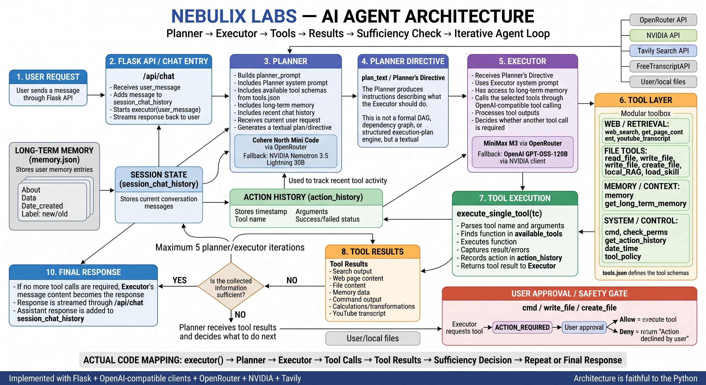

# 🚀 Open-Handler

### A Modular AI Agent Framework powered by the **Nebul Architecture**

**Open-Handler** is an open-source AI agent project designed to provide a flexible foundation for building, experimenting with, and extending personal AI agents.

It follows a **Planner → Executor → Tools** architecture, allowing the agent to understand tasks, create plans, execute actions through tools, inspect results, and produce a final response.

> **Plan → Execute → Use Tools → Review Results → Respond**

---

## 🧠 Nebul Architecture

Open-Handler is built around the **Nebul Architecture**, a modular agent design created by **Nebulix Labs**.

The core workflow looks like:

```text
                         USER
                           │
                           ▼
                    ┌─────────────┐
                    │   PLANNER   │
                    │             │
                    │ Understand  │
                    │    Task     │
                    └──────┬──────┘
                           │
                           ▼
                    ┌─────────────┐
                    │  EXECUTOR   │
                    │             │
                    │ Execute     │
                    │   Plan      │
                    └──────┬──────┘
                           │
              ┌────────────┼────────────┐
              ▼            ▼            ▼
           SEARCH        FILES       COMMANDS
              │            │            │
              └────────────┼────────────┘
                           │
                           ▼
                    ┌─────────────┐
                    │    TOOLS    │
                    └──────┬──────┘
                           │
                           ▼
                     TOOL RESULTS
                           │
                           ▼
                    ┌─────────────┐
                    │   PLANNER   │
                    │   REVIEWS   │
                    │   RESULTS   │
                    └──────┬──────┘
                           │
                    ┌──────┴──────┐
                    ▼             ▼
                  MORE?        FINISHED
                    │             │
                    ▼             ▼
                  TOOLS        RESPONSE
```

### Architecture Diagram



The architecture is designed to keep the agent's **reasoning, execution, and tools** separated into clear components, making the system easier to modify and extend.

---

## ✨ Features

* 🧠 Planner + Executor architecture
* 🔧 Extensible tool system
* 🌐 Web search capabilities
* 📁 File operations
* 🧩 Custom skills
* 💾 Local long-term memory
* 🔐 Action approval for sensitive operations
* 🤖 Configurable AI models
* 🔄 Multi-step agent execution
* 🖥️ Local web interface
* 🛠️ Easy to customize and extend

---

## 🏗️ How Open-Handler Works

A typical request flows through the agent like this:

```text
User Request
     │
     ▼
  Planner
     │
     ▼
  Executor
     │
     ▼
  Tool Call
     │
     ▼
 Tool Result
     │
     ▼
 Planner Reviews Result
     │
     ├──────► More Tools Needed
     │
     ▼
 Final Answer
```

The current implementation can perform multiple planning/execution cycles, allowing the agent to use several tools before returning its final response.

---

## 🤖 AI Models

Open-Handler uses configurable AI models.

### Planner

Current model:

```text
cohere/north-mini-code:free
```

Fallback:

```text
nvidia/nemotron-3.5-lightning-30b-a3b
```

### Executor

Current model:

```text
minimax/minimax-m3:free
```

Fallback:

```text
openai/gpt-oss-120b
```

These models are configurable and can be replaced with other compatible models as provider availability changes.

Example:

```python
model="your/new-model"
```

---

## 🌐 Services

The project can work with accessible/free-tier services depending on provider availability.

| Service    | Purpose            |
| ---------- | ------------------ |
| OpenRouter | Primary AI models  |
| NVIDIA API | Fallback AI models |
| Tavily     | Web search         |

> ⚠️ Free tiers, limits, pricing, model availability, and provider policies can change. Always check the providers' current terms.

---

## 🔑 API Keys

Open-Handler follows a **Bring Your Own API Keys** approach.

Create:

```text
Aiapi.env
```

Example:

```env
OPENROUTER=your_openrouter_api_key
AIAPI=your_nvidia_api_key
SEARCHAPI=your_tavily_api_key
```

### ⚠️ Never commit API keys

Add your environment file to `.gitignore`:

```gitignore
Aiapi.env
.env
venv/
__pycache__/
*.pyc
```

---

## 📁 Project Structure

A typical project structure looks like:

```text
Open-Handler/
│
├── app.py
├── index.html
│
├── images/
│   └── arcitecture_handler.png
│
├── Aiapi.env
├── system.json
├── tools.json
├── tool_policy.txt
├── perms.txt
├── memory.json
│
├── requirements.txt
└── README.md
```

---

## ⚙️ Installation

### 1. Clone the repository

```bash
git clone https://github.com/NebulixLabs/Open-Handler.git
cd Open-Handler
```

### 2. Create a virtual environment

#### Windows

```bash
python -m venv venv
venv\Scripts\activate
```

#### Linux / macOS

```bash
python3 -m venv venv
source venv/bin/activate
```

### 3. Install dependencies

```bash
pip install -r requirements.txt
```

Example dependencies:

```text
openai
flask
python-dotenv
requests
flask-cors
tavily-python
```

---

## ▶️ Run Open-Handler

Start the application:

```bash
python app.py
```

The local server runs at:

```text
http://127.0.0.1:8080
```

You can access the UI at:

```text
http://127.0.0.1:8080/home
```

---

## 🧰 Tools

Open-Handler can work with tools such as:

```text
web_search
read_file
write_file
create_file
local_RAG
load_skill
memory
cmd
check_perms
get_action_history
date_time
tool_policy
```

The tool system is designed to be extensible, so developers can add, remove, or modify tools according to their requirements.

---

## 🧩 Custom Tools

You can create your own tool:

```python
def my_custom_tool(value: str) -> str:
    return f"Received: {value}"
```

Then register it:

```python
available_tools = {
    ...
    "my_custom_tool": my_custom_tool
}
```

And define its schema in:

```text
tools.json
```

This allows the executor to call custom functionality.

---

## 🧩 Skills

Skills can be created using:

```text
.md
.txt
```

Example:

```text
skills/
├── coding.md
├── research.md
├── python.md
└── writing.md
```

The agent can load these skills through the `load_skill` tool.

You are free to modify and extend the skill system for your own use cases.

---

## 🧠 Long-Term Memory

Open-Handler currently stores long-term memory in:

```text
memory.json
```

The memory system can later be replaced or extended with:

* SQLite
* PostgreSQL
* Vector databases
* Cloud databases
* Embedding-based memory systems

---

## 🔐 Security

Open-Handler includes command execution capabilities, which can be powerful and potentially dangerous.

For example:

```python
subprocess.run(..., shell=True)
```

Sensitive operations can require user approval before execution.

Example action types include:

```text
cmd
write_file
create_file
```

> ⚠️ The approval mechanism should **not** be considered a complete production security system.

If you deploy Open-Handler publicly, implement appropriate:

* Authentication
* Authorization
* Sandboxing
* Input validation
* Permission controls
* Secret management
* File-access restrictions
* HTTPS
* Logging and monitoring

**Do not expose unrestricted shell execution or the development server directly to the public internet.**

---

## 👤 Current Limitations

The current version is designed primarily for:

> **One user on one device / local environment.**

Application state and memory are stored locally, so this version should not be considered a production-ready multi-user platform.

For multi-user deployment, consider adding:

* User authentication
* User-specific sessions
* Database-backed memory
* Per-user permissions
* API rate limiting
* Secure secret management
* Background task management
* Sandboxed execution

---

## 🌍 Roadmap

* [ ] Multi-user authentication
* [ ] Database-backed memory
* [ ] Vector RAG
* [ ] Better document processing
* [ ] PDF support
* [ ] Image understanding
* [ ] Voice input/output
* [ ] Browser automation
* [ ] Scheduled tasks
* [ ] Background agents
* [ ] Docker support
* [ ] Cloud deployment
* [ ] Sandboxed terminal
* [ ] Persistent conversations
* [ ] Agent task queues
* [ ] Plugin system
* [ ] Configurable models from UI

---

## 🤝 Contributing

Contributions are welcome!

1. Fork the repository.
2. Create a feature branch.
3. Make your changes.
4. Test your changes.
5. Open a Pull Request.

Example:

```bash
git checkout -b feature/my-feature
```

```bash
git commit -m "Add my feature"
```

```bash
git push origin feature/my-feature
```

---

## ❤️ Credits

**Open-Handler** is developed by **Nebulix Labs**.

The project is based around the **Nebul Architecture**:

> **Plan → Execute → Use Tools → Review Results → Respond**

If you use or substantially reproduce the Nebul Architecture, please provide appropriate courtesy attribution to **Nebulix Labs**.

AI-generated supporting materials such as prompts, skills, tool policies, schemas, and configuration text are intended to be reusable and modifiable, subject to any rights or licenses that may independently apply to third-party material.

---

## 📜 License

Before publishing or distributing this repository, add an explicit open-source license in:

```text
LICENSE
```

The license should clearly define the terms for the source code, architecture, UI, documentation, branding, and derivative works.

> **Do not rely on the README alone as the legal license for the project.**

---

## 👨‍💻 Developer

### Nebulix Labs

GitHub: **NebulixLabs**

Instagram: **@Nebulixlabs**

---

## ⭐ Support the Project

If you find **Open-Handler** useful:

⭐ Star the repository
🍴 Fork the project
🛠️ Build your own tools
🧩 Create new skills
🚀 Experiment with the architecture
🤝 Contribute improvements

---

# 🚀 Open-Handler

### Powered by the **Nebul Architecture**

**Plan → Execute → Use Tools → Learn from Results → Respond**

Built with curiosity.
Designed for experimentation.
Made by **Nebulix Labs**.
